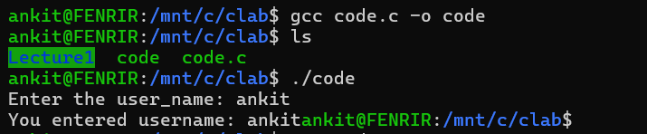
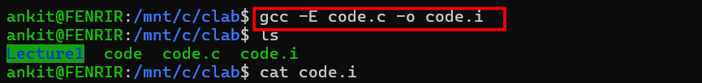
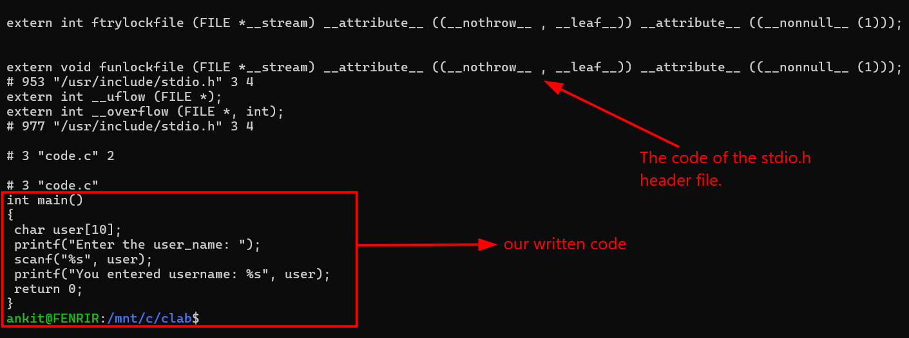
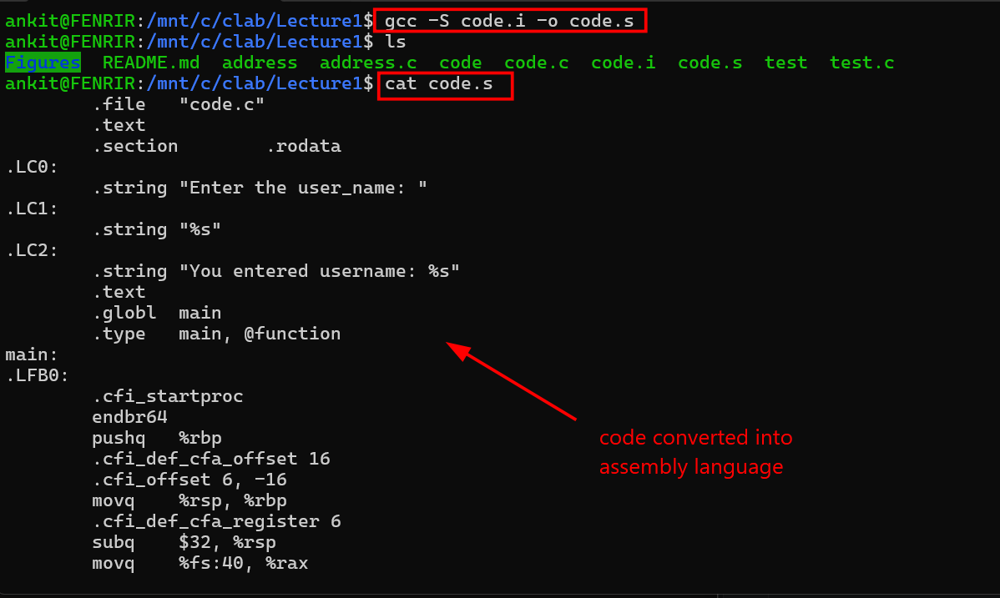

# Understanding the behaviour of C at Backend

C is a mid level programming language. It is considered mid-level because it is simple to understand and also have a low level hardware access. A source code written in c passes through four processes before execution. These steps are done at the backend so it is not visible to the user. Only the output at the end is shown to the user. The structure of the C program includes the four stages of compilation i.e 
- **Preprocessing**
- **Compilation** 
- **Assembly** & 
- **Linking** 

Each step has its own distinctive roels in converting the human redeable c into machine executable program.

## Learning objective

1. To understand the diffrence between a source code and an process.  
2. To understand all the four steps involved during compilation.
3. To practically see the working of C using the gcc compiler at each of the 4 steps.
 
A source code is a program that is written by a programmer in high level language. It is at static state which means until and unless a program executes it. The source code is basically a buch of text sitting in a file. But when the source code is compiled and run it becomes a process. The process is at a dynamic state. It means a process is an active instance of a program in a computers memory. 

The source code is read by the compiler ad processsed through the four main stages. The final result of this process is usually a static executable binary file on disk. The four main stages include:

### 1.Preprocessing
This is the first step in the compilation process. The preprocessor trandforms the source code before compiler analyzes it. It processes all the directives starting with the # to prepare the code for execution.It adds the code of the specific header file like (**stdio.h**) directly into the source code. It removes all the comments in the code also. In order to see how processor works in actual. We will use The command given below in the gcc compiler. 

**command to see the Preprocessing**
```bash
gcc  -E code.c -o code.i 
cat code.i
```
The results of this command is given below.



We have used the gcc to successfully execute the code. The output is also properly displayed. now we will see the working of the preprocessor using the gcc. 





 
 from the image we can see that the #include<stdio.h> is missing and is replaced by texts. The coment in the initial code is also gone. This expanded serves as input for the compilation. 


### 2. Compilation

The expanded code in the preprocessing phase acts as input for the compilation phase. In this stage the processed C code is converted into assembly language. The compiler takes the preprocessed source code and performs synatx anakysis, sematic analysis etc. The output of the compilation is an assembly source file(.s). In order to see this in actual practice we will use the codes given below in the gcc compiler. 

```bash
gcc -S code.i -o code.s
cat code.s
```
The output of this command is below.



Optimizations like dead code-eliminations, inlining etc are alo done in this phase. 

