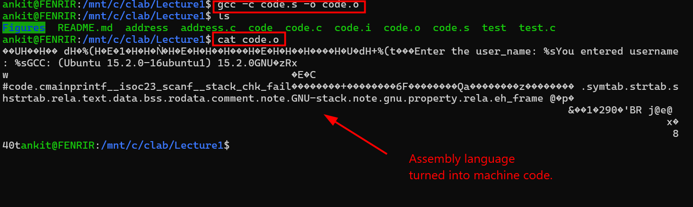
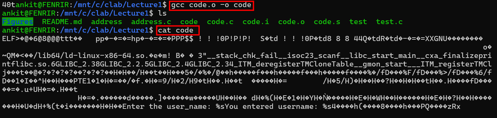
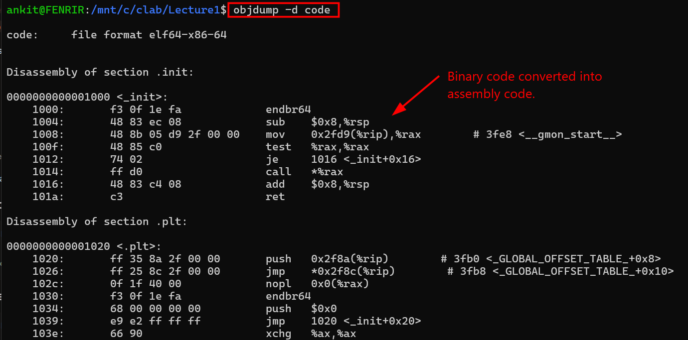

# Understanding the behaviour of C at Backend

C is a mid level programming language. It is considered mid-level because it is simple to understand and also have a low level hardware access. A source code written in c passes through four processes before execution. These steps are done at the backend so it is not visible to the user. Only the output at the end is shown to the user. The structure of the C program includes the four stages of compilation i.e 
- **Preprocessing**
- **Compilation** 
- **Assembly** & 
- **Linking** 

Each step has its own distinctive roels in converting the human redeable c into machine executable program.

## Learning objective

1. To understand the diffrence between a source code and an process.  
2. To understand all the four steps involved during compilation.
3. To practically see the working of C using the gcc compiler at each of the 4 steps.
 
A source code is a program that is written by a programmer in high level language. It is at static state which means until and unless a program executes it. The source code is basically a buch of text sitting in a file. But when the source code is compiled and run it becomes a process. The process is at a dynamic state. It means a process is an active instance of a program in a computers memory. 

The source code is read by the compiler ad processsed through the four main stages. The final result of this process is usually a static executable binary file on disk. The four main stages include:

### 1.Preprocessing
This is the first step in the compilation process. The preprocessor trandforms the source code before compiler analyzes it. It processes all the directives starting with the # to prepare the code for execution.It adds the code of the specific header file like (**stdio.h**) directly into the source code. It removes all the comments in the code also. In order to see how processor works in actual. We will use The command given below in the gcc compiler. 

**command to see the Preprocessing**
```bash
gcc  -E code.c -o code.i 
cat code.i
```
The results of this command is given below.


We have used the gcc to successfully execute the code. The output is also properly displayed. now we will see the working of the preprocessor using the gcc. 


 
 from the image we can see that the #include<stdio.h> is missing and is replaced by texts. The coment in the initial code is also gone. This expanded serves as input for the compilation. 


### 2. Compilation

The expanded code in the preprocessing phase acts as input for the compilation phase. In this stage the processed C code is converted into assembly language. The compiler takes the preprocessed source code and performs synatx anakysis, sematic analysis etc. The output of the compilation is an assembly source file(.s). In order to see this in actual practice we will use the codes given below in the gcc compiler. 

**command to see the compilation**

```bash
gcc -S code.i -o code.s
cat code.s
```
The output of this command is below.


Optimizations like dead code-eliminations, inlining etc are alo done in this phase. 

### 3. Assembly 

In this stage the assembly language is converted into the machine code. The assembler also produces a relocatable object file. The assembler reads the (.s) file and translates each assembly instructions into its binary machine-cde encoding. The assembler also resolves local labels and computes addresses within the current file.It also emits a relocatable object file (.o) in the unix system and (.obj) on windows. We will use the command below to read the (.o) object file in the gcc compiler.

**command to see the Assembly**
```bash
gcc -c code.s -o code.o
cat code.o
```
The output of the command is given below.




After assembly the object files contains the machine code but is not yet executable. It is so because external references to library functions or the other object file remains unresolved also the final addresses have not been assigned. 

### 4. Linking

In this stage the linker patches the adderesses in the code and data according to the final memory layout. It also matches the undefined symbols in one object file with definations in the other files or libraries(libc ,etc). Linker also combines corresponding sections from the multiple object files and places them at appropriate virtual addresses.we are able to view this process by using the command given below. 

**command to see the Linking**
```bash
gcc code.o -o code
cat code 
```
The result of this command is given below.



By using cat also we are not able to rad the contents as it is not in text form. Cat reads the raw byte and convert the into redeable text. but here the code is in the binary form. So cat is not able to convert them into the text. So we will use objdump. objdump reads the binary machine code and converts them into human redeable assembly language. 

**command to see the binary code into human redeable assembly languaged**
```bash
objdump -d code
```


After linking the resulting binary is ready for the operating system loader to map into memory and begin execution. 


## Conclusion.
SO these were the four steps that happens during execution of the C source code. The execution of any C code is the cumulation of all these steps.We are able to view all of this in actual practice by using the gcc compiler in the linux OS. The features of GCC allow us to view and examine each stage of the compilation process in practice by using specific flags that stop the process at intermediate steps.

## **Author:Ankit Thebe**
